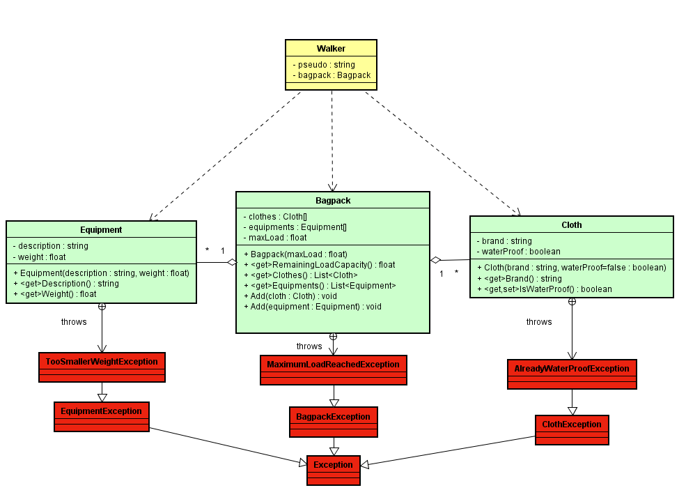

# 226a - Walking In The Wild

## Sujet à traiter
Vous êtes responsable de coder des librairies qui serviront une équipe développant un simulateur de marcheurs à pied.

### Architecture



## Explications sur l'architecture du code

* La classe **Walker.cs** est pour l'instant inutile. Ne vous en préocuppez pas.

* La classe **Bagpack.cs** est conçue pour se comporter comme un sac à dos qui pourra intégrer aussi bien du matériel en tout genre (gourde, couverture, jumelles,...) tout comme des vêements.

* Les classes **Equipment** et **Cloth** quant à elles simulent des équipments et les habits à chager dans le sac à dos.

### Aides métier
1) On ne peut actuellement qu'ajouter des éléments au sac à dos.

2) L'ajout d'un équipement dans le sac à dos, réduit progressivement sa capacité de charge.

3) L'ajout de vêtement est pour l'instant illimité.

4) Prenez garde aux différentes exceptions à traiter.
   * Un équipement doit avoir un poids positif.
   * Un sac à dos à une charge limite.
   * Un vêtement peut être traité pour être résistant à la pluie. Inutile de le faire sur un vêtement qui est déjà résistant à la pluie.

### Prise en main du code

1)  Récupérer le dépôt
   
```
    git clone https://NGY_CPNV@bitbucket.org/cpnv_ngy/226a_walkinginthewild.git
```

2) Réaliser la première compilation. Il est important que le réseau soit disponible. Le gestionnaire de dépendences (Nguet) en a besoin fonctionner correctement.

```
2>------ Build started: Project: TestWalkingInTheWild, Configuration: Debug Any CPU ------
2>[...[]]
2>Done building project "TestWalkingInTheWild.csproj".
========== Build: 2 succeeded, 0 failed, 0 up-to-date, 0 skipped ==========
```

3) lancer ensuite tous les tests du projet


### Moyens à disposition

* un environnement de développement Visual Studio 2022 Entreprise
* tout le code produit durant le cours
* le réseau est exclu (excepté pour la première compilation) tout comme le travail collaboratif
* 45 minutes

### Livrables attendus
Une archive compressée contenant **uniquement** les deux classes métiers([nomDeFamille_TDD].zip).

Modalités de livraison à définir avec l'animateur.

### Evaluation

1pt par test d'acceptation réussi.

12pts au total.

Conditions d'acceptations:

* Respect des principes POO (encapsulation).
* Les classes de tests ne doivent avoir subi aucune modification.
* L'architecture des classes productives ne doit pas avoir été modifiée (signature des fonctions)

**Notation**

    Note = (nbPointsObtenus/nbPointsMax)/5+1

**Auteur**

Nicolas Glassey

06-NOV-2022